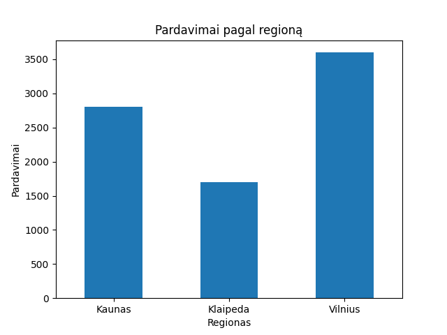
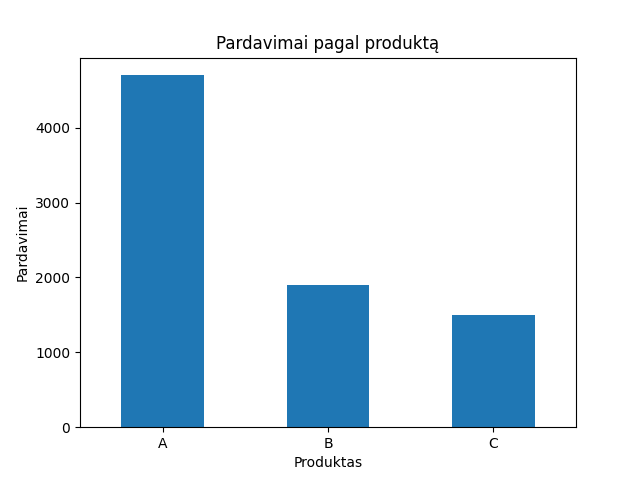
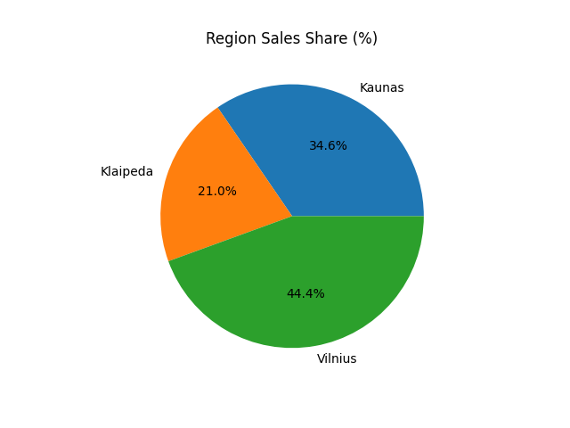

# Sales Performance Analysis

This project analyzes sales data to identify top-performing regions and products, calculate key performance indicators (KPI), and generate business insights using Python (pandas, matplotlib).

The goal of this analysis is to demonstrate practical data analysis skills including:
- Data aggregation
- KPI calculation
- Percentage share analysis
- Data visualization
- Business insight generation

# Sales Performance Analysis

## Sales by Region

## Sales by Product

## Key Performance Indicators (KPI)

- **Total Revenue:** 8100  
- **Average Daily Revenue:** 1157.14  
- **Top Performing Region:** Vilnius  
- **Top Performing Product:** A  

## Business Insights

The analysis shows that Vilnius is the strongest performing region.  
Product A generates the highest revenue.  
Strategic focus should be placed on scaling top-performing regions and improving performance in lower-performing areas.

## Region Sales Share (%)

